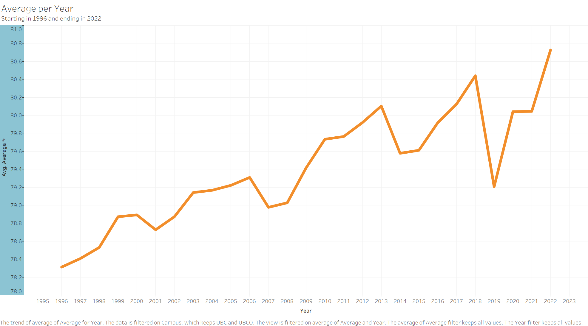

## Grade Averages - Are they affected by Major Events?

Major events both locally and globally affect a multitude of situations, the purpose of this research and analysis is to find out if it is possible to see the affect of major events on grades. I am curious if it is possible to see that there is an event during a particular semester based off grades alone without the prior knowledge of the event. In addition, I would like to see if there is any change in the academic intelligence of students year to year. The full analysis notebook and code can be found [here.](https://github.com/ubco-W2022T1-cosc301/project-group27)

Highlights of Analysis include some visuals

Firstly let's look at the amount of data available. This graph shows the amount of data entries per campus. As we can see there is significantly more data for UBC available than data from UBCO. Mostly this is because UBC offers more years of data. More than that is that UBC has more students and more courses per semester than UBCO.

In this graph we see the amount of average values. The data itself has cutoffs because classes with not enough people are excluded. So earlier years will have some missing data but that data can skew the results so its better to have it removed. Also in general any class that is less than 6 people will have the data removed. Here we can see that across al the averages there is a pretty even average of averages. 85 percent is the the most common average that shows up 

Here is the main graph. This shows the average per year. There are rises and falls that show how the grades have changed year to year. As can been seen on the graph there are a handful of bigger drops in the averages. Each bigger drop correlates to some sort of major event. Some happened locally while others were foreign or global. The drops are in 2001, 2007, 2007-2009, and in 2016, ad 2020. 

In 2001 there was the September 11th attacks in the United States. WHile not in Canada they had a major effect on the world at large. A shocking tragedy that was a major change to peoples psyche. Also there was a bus worker strike that lasted months during that same year. This too would cause lots of students to not be able to get to class every time and would change their grades because of not learning he material they needed to. 

In 2007 to 2009 there were two major events that happened. One in 2007 was the Virginia Tech Massacre, it was an attack on a University and so it would have an affect on all students minds during the months after that event. The other event was the major stock market crash. It affected so many things in everyone's lives that students would more likely focus on other aspects of their lives, school taking a backseat while they figure things out. 

In 2016 there was a massive bus worker strike in BC. The strike was felt most by families and students. Students weren't able to get to class nearly as often as they would before and missing out on those weeks of education noticeably lowered the grade average. 

Finally in 2020, the Pandemic. A world changing event that was felt by everyone. Classes switched to being remote and many students didn't learn the same way as usual. Harder to absorb information when it was switched to remote learning. Adding to that was the immense stress of the pandemic, the price increases, and the loss of family. Lock downs and quarantines forcing the classes online was very chaotic. The grades fell sharply because of this. However as we can see the grades have been recovering and rising since then. As people got used to remote learning and classes returned to in person the grades have improved.  

I didn't know about all of the events before doing the analysis and it was interesting to find out that there was something that caused each drop in grades. Also as can be seen by the previous graph, there is a rise in the grade average over time. One of my questions was whether it was possible to see how the academic intelligence of students changes over the years. As it turns out it is rising and at a steady pace. No matter the major event the academic intelligence recovers and increases. This could be because of an increase in the efficiency of schooling along with better literacy rates. I was surprised to find that the grades recovered so quickly after the initial drop of the pandemic.

 In conclusion we can see by the data that major events both local and global can have an affect on the grades of students. It was interesting to find out that there is a noticeable change in grades when that year has a particular event during it. Every drop is in the same year/s that a major event happened. Also I learnt quite a lot about data analytics during this project. It gave me a much better understanding of what goes into the process of data analysis and a much greater appreciation for those that do it. Also it made me realize the importance of a full dataset. I had a lot of data but I wished for more, especially from UBCO which didn't have very much at all. I know that it would still give me the same results but I would have liked to make a comparison between the campuses and possibly there would have been some differences in the grade averages between them.  