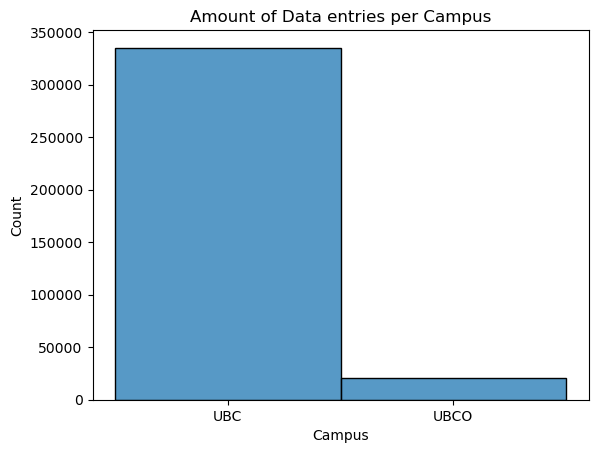

Intro
## Grade Averages - Are they affected by Major Events?

Major events both locally and globally affect a multitude of situations, the purpose of this research and analysis is to find out if it is possible to see the affect of major events on grades. I am curious if it is possible to see that there is an event during a particuler semester based off grades alone without the prior knowledge of the event. In addition, I would like to see if there is an increase in the academic intelligence of students year to year. The full analysis otebook and code can be found here.

Highlights of Analysis include some visuals

Firstly let's look at the amount of data available. This graph shows the amount of data entries per campus. As we can see there is significanty more data for UBC available than data from UBCO. Mostly this is because UBC offers more years of data. More than that is that UBC has more students and more courses per semester than UBCO.

In this graph we see the amount of averages per year

Here is the main graph. This shows the average per year 

results: 2-3 visuals 

summary/conclusion highlghts and what was learnt